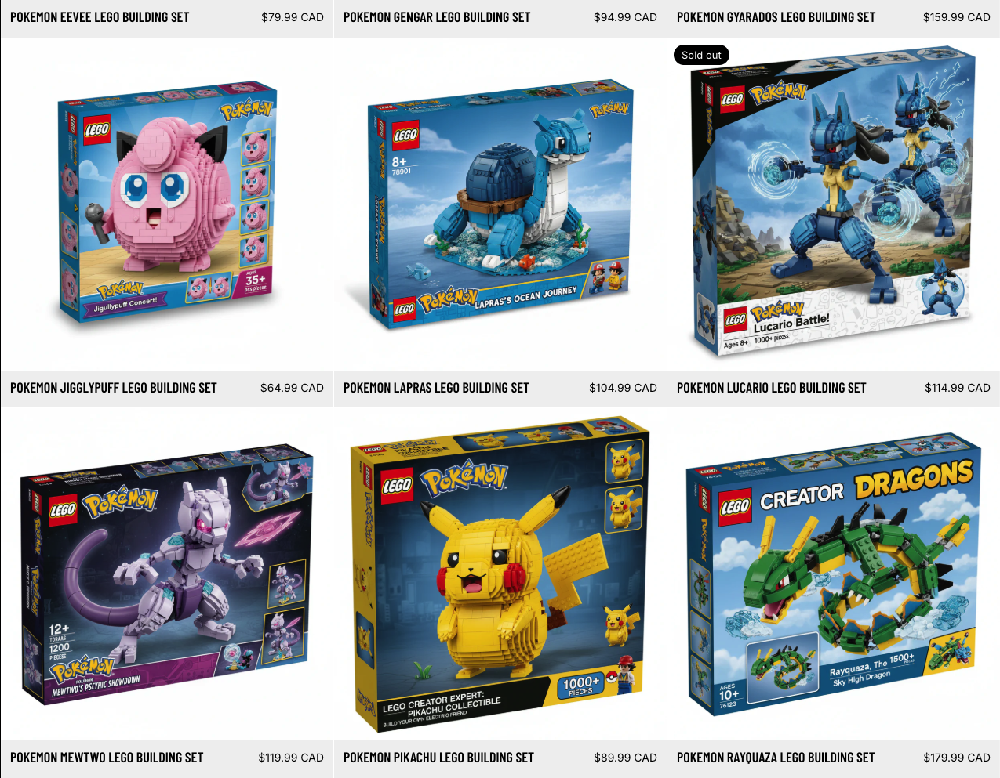
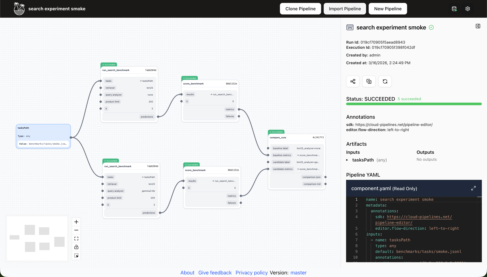

# Commerce Query-Aware Search

Applied ML/search project for a Pokemon-themed storefront built on the Shopify Storefront API. The repo is structured to show practical search engineering, deterministic commerce correctness, reproducible benchmarking, and clear orchestration boundaries for Tangle and SkyPilot.

## Overview

The system supports two search modes:

- Baseline lexical search: raw query into overlap or BM25 retrieval.
- Query-aware search: Gemma/Ollama analyzes the query, rewrites it for retrieval, proposes candidate entities, and code enforces hard constraints such as price and stock.

Core principle: the LLM interprets intent and query meaning, but runtime code enforces truth from real catalog fields.
If query-aware search is requested and the analyzer is unavailable, the run fails closed instead of silently degrading to a lexical baseline.

## Storefront Context

The project uses a Pokemon-themed storefront backed by the Shopify Storefront API.



## Example Query

Example query:

```text
yellow pokemon in stock between $20 and $30
```

What the system does with it:

- Baseline lexical search matches literal overlap such as `yellow`, `pokemon`, and `stock`, which is simple but can miss relevant products if the catalog uses names like `Pikachu` instead of the broader theme term `pokemon`.
- Query-aware search asks Gemma/Ollama to interpret the request into structured intent, such as theme=`pokemon`, color=`yellow`, in_stock=`true`, and price range=`20..30`.
- Retrieval uses that interpretation to expand or rewrite the query for better candidate recall.
- Final filtering is deterministic: only products that are actually in stock and whose real catalog price falls between `$20` and `$30` are allowed through.

That example captures the main design goal of the project: let the model interpret the user request, but keep catalog truth and hard constraints in code.

## Tangle Workflow

The smoke pipeline runs two benchmark branches in parallel, scores both locally, and compares the resulting metrics.



## Results

### Smoke Benchmark Snapshot

The local Tangle smoke pipeline scores 10 tasks and compares a plain BM25 baseline against BM25 plus Gemma-based query analysis.

| System | Pass Rate | MRR@5 | Constraint Failures |
| --- | ---: | ---: | ---: |
| BM25 baseline | 50% (5/10) | 0.75 | 1 |
| BM25 + Gemma query analysis | 70% (7/10) | 1.00 | 0 |

### Full Prediction Pass

The saved full-run prediction artifacts cover 100 queries. On the 76 title-grounded ranking tasks in that set, the query-aware run improved reciprocal-rank position on 16 tasks, regressed on 6, and tied the baseline on 54.

### Representative Query Outcomes

**`pikchu lego`**  
Baseline top result: `Pokemon Rayquaza LEGO Building Set`  
Query-aware top result: `Pokemon Pikachu LEGO Building Set`  
Why it improved: the analyzer rewrote the misspelling and expanded retrieval toward the intended entity.

**`in stock pokemon lego`**  
Baseline top result: `Pokemon Lucario LEGO Building Set`  
Query-aware top results: `Pokemon Pikachu LEGO Building Set`, `Pokemon Bulbasaur LEGO Building Set`, `Pokemon Snorlax LEGO Building Set`  
Why it improved: query-aware search extracted `in_stock=true`, and deterministic filtering removed unavailable products from the final set.

**`yellow electric mouse lego`**  
Baseline top three: `Umbreon`, `Pikachu`, `Rayquaza`  
Query-aware top three: `Pikachu`, `Umbreon`, `Eevee`  
Why it improved: the analyzer surfaced the intended Pokemon concept instead of relying on lexical overlap alone.

**`blue jackal pokemon lego`**  
Baseline top three: `Eevee`, `Squirtle`, `Bulbasaur`  
Query-aware top three: `Bulbasaur`, `Lucario`, `Eevee`  
Why it improved: semantic expansion recovered `Lucario`, which the baseline missed entirely in the top three.

### Remaining Limitations

Broad browse-style requests such as `show me the catalog` still underperform because the current system is optimized for entity- or constraint-driven retrieval, not open-ended catalog browsing. The full run also still contains some semantic regressions, such as `sleepy big pokemon lego`, where the query-aware branch drifted away from the correct `Snorlax` result.

## Architecture

- [catalog.py](src/shopify_ml_demo/catalog.py): Shopify Storefront API client and catalog normalization.
- [query_analysis.py](src/shopify_ml_demo/query_analysis.py): local Ollama/Gemma query interpretation.
- [retrieval.py](src/shopify_ml_demo/retrieval.py): overlap and BM25 retrieval.
- [filtering.py](src/shopify_ml_demo/filtering.py): deterministic hard-constraint enforcement.
- [search.py](src/shopify_ml_demo/search.py): baseline and query-aware search engines.
- [evaluation.py](src/shopify_ml_demo/evaluation.py): benchmark task loading and prediction generation.
- [metrics.py](src/shopify_ml_demo/metrics.py): scoring logic and failure extraction.
- [comparison.py](src/shopify_ml_demo/comparison.py): run comparison JSON and Markdown reporting.

## Repo Structure

```text
benchmarks/
  tasks/
    smoke.jsonl
    full.jsonl
artifacts/
  smoke/
  full/
orchestration/
  skypilot/
    sky_smoke_benchmark.yaml
    sky_full_benchmark.yaml
    sky_smoke_eval.yaml
    sky_full_eval.yaml
    sky_devbox.yaml
  tangle/
    components/
    pipelines/
scripts/
  run_search_query.py
  run_search_benchmark.py
  score_benchmark.py
  compare_runs.py
src/shopify_ml_demo/
tests/
  unit/
  integration/
```

## Local Setup

Create a virtual environment, install dependencies, and configure environment variables:

```bash
python3 -m venv .venv
source .venv/bin/activate
pip install -r requirements.txt
cp .env.example .env
```

Required environment variables:

- `SHOPIFY_STORE_DOMAIN`
- `SHOPIFY_STOREFRONT_TOKEN`

Optional query-analysis variables:

- `OLLAMA_URL`
- `OLLAMA_MODEL`

## Local Usage

Single-query debug:

```bash
.venv/bin/python scripts/run_search_query.py "pikchu lego" --retriever bm25 --query-analyzer gemma3:4b --show-trace
```

Smoke benchmark predictions only:

```bash
.venv/bin/python scripts/run_search_benchmark.py \
  --tasks benchmarks/tasks/smoke.jsonl \
  --retriever bm25 \
  --query-analyzer gemma3:4b \
  --out artifacts/smoke/retriever=bm25__analyzer=gemma3_4b/predictions.jsonl
```

Score benchmark predictions:

```bash
.venv/bin/python scripts/score_benchmark.py \
  --results artifacts/smoke/retriever=bm25__analyzer=gemma3_4b/predictions.jsonl \
  --metrics-out artifacts/smoke/retriever=bm25__analyzer=gemma3_4b/metrics.json \
  --failures-out artifacts/smoke/retriever=bm25__analyzer=gemma3_4b/failures.jsonl
```

Compare two runs:

```bash
.venv/bin/python scripts/compare_runs.py \
  --baseline-metrics artifacts/smoke/retriever=bm25__analyzer=none/metrics.json \
  --candidate-metrics artifacts/smoke/retriever=bm25__analyzer=gemma3_4b/metrics.json \
  --out-json artifacts/smoke/comparison.json \
  --out-md artifacts/smoke/comparison.md \
  --baseline-label bm25__analyzer=none \
  --candidate-label bm25__analyzer=gemma3_4b
```

## Benchmark Design

The benchmark suite is split into:

- `smoke.jsonl`: small, fast validation set for development loops and orchestration smoke tests.
- `full.jsonl`: broader benchmark for stronger evaluation and regression tracking.

Each prediction run writes a dedicated artifact directory keyed by orthogonal experiment dimensions:

- `retriever=<name>`
- `analyzer=<name or none>`

Example:

- `artifacts/smoke/retriever=bm25__analyzer=none/`
- `artifacts/smoke/retriever=bm25__analyzer=gemma3_4b/`

Each run directory contains:

- `predictions.jsonl`
- `metrics.json`
- `failures.jsonl`

## Tangle

Tangle is used as a workflow orchestrator over stable CLI boundaries, not as an internal search runtime. Components in [orchestration/tangle/components](orchestration/tangle/components) wrap:

- benchmark execution
- scoring
- run comparison

The smoke pipeline in [pipeline.yaml](orchestration/tangle/pipelines/search_experiment_smoke/pipeline.yaml) expresses the experiment flow:

1. baseline benchmark
2. baseline scoring
3. query-aware benchmark
4. query-aware scoring
5. comparison artifact generation

For local Tangle execution, build the local component image first:

```bash
docker build -t commerce-query-aware-search:tangle-local .
```

And keep Docker running before starting the Tangle backend. If you want the structured branch to execute inside Tangle, run Ollama on the host as well:

```bash
ollama serve
ollama pull gemma3:4b
```

## SkyPilot

SkyPilot workloads live in [orchestration/skypilot](orchestration/skypilot):

- `sky_smoke_benchmark.yaml`: benchmark-only smoke workload for Tangle/SkyPilot integration
- `sky_full_benchmark.yaml`: benchmark-only full workload for Tangle/SkyPilot integration
- `sky_smoke_eval.yaml`: smoke benchmark batch run
- `sky_full_eval.yaml`: full benchmark batch run
- `sky_devbox.yaml`: interactive environment for debugging

In this project, SkyPilot is used as a declarative execution layer: each YAML defines the resources, environment variables, secrets, setup steps, and CLI entrypoint for a workload. That keeps the execution contract in one place and separates it from the search logic itself.

They cover benchmark jobs, evaluation jobs, and a devbox pattern without adding an extra platform layer for routing, quotas, or policy management.

SkyPilot configs in this repo own execution-environment concerns only:

- package installation
- Ollama installation/startup
- env/secrets wiring
- which CLI entrypoint is executed

The current working orchestration path is the local Tangle DAG. SkyPilot remains in the repo as a parallel way to express benchmark, evaluation, and devbox workloads. The same SkyPilot workflow can be retargeted to other supported backends by adjusting resources, secrets, and artifact handling.

## Limitations

- Query analysis currently relies on a local Ollama-compatible API; query-aware runs fail closed if the analyzer is unavailable.
- Constraint enforcement is intentionally limited to catalog-truth fields like price and stock.
- Entity expansion improves recall for some semantic queries but is still heuristic.

## Next Step

The next improvement I would make is a reranking layer on top of the current retrieval stack. That would give the system a cleaner way to sort semantically close candidates without turning soft signals like color or inferred entities into hard filters.
